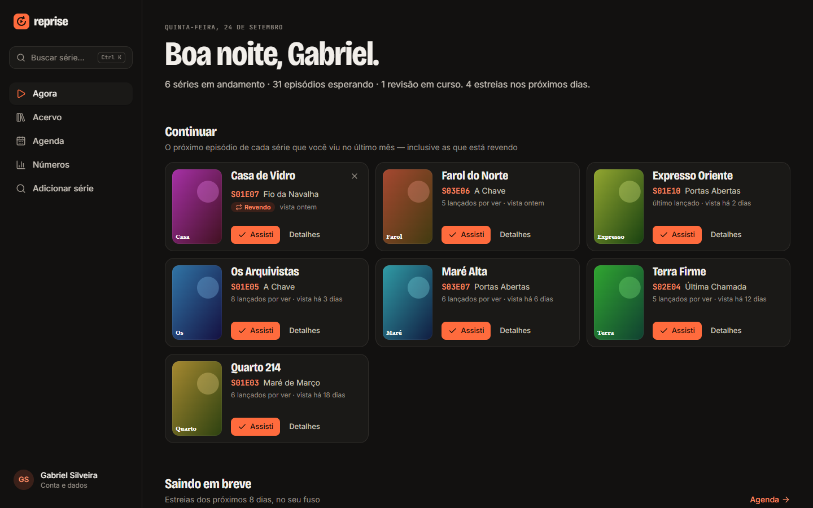
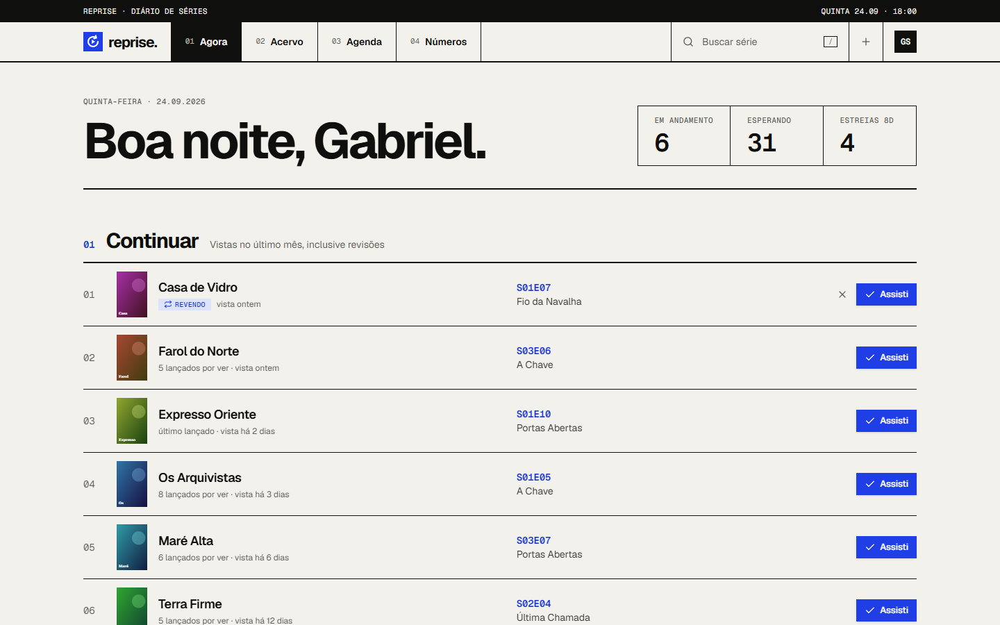
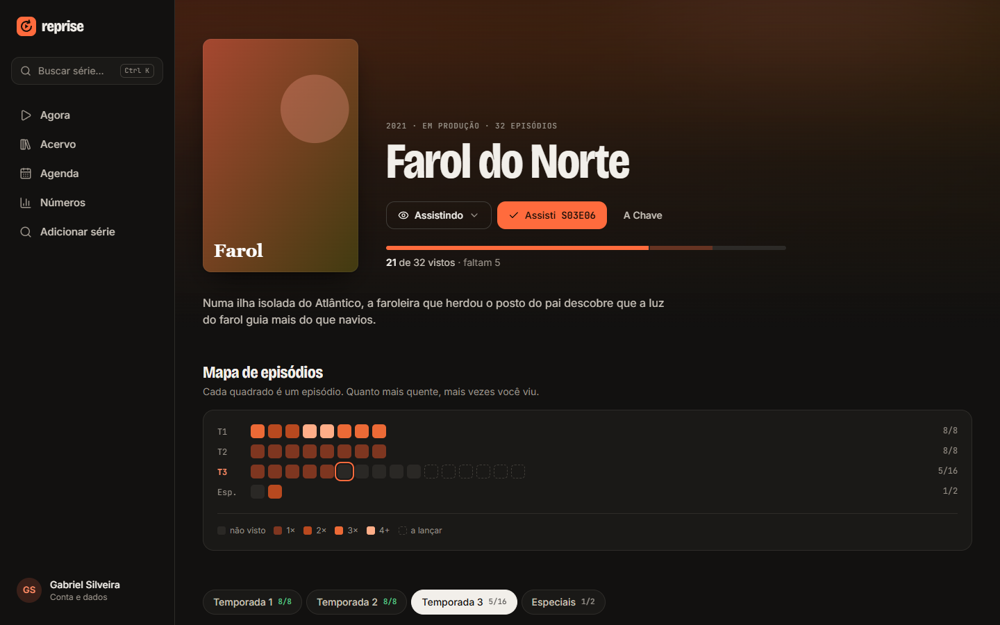
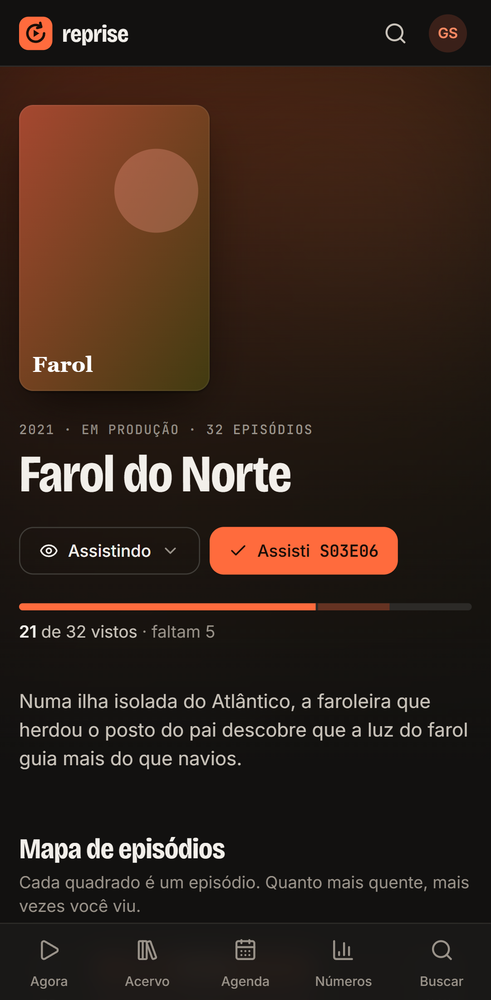
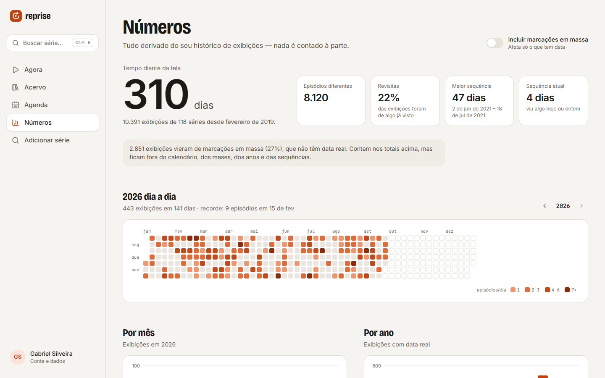
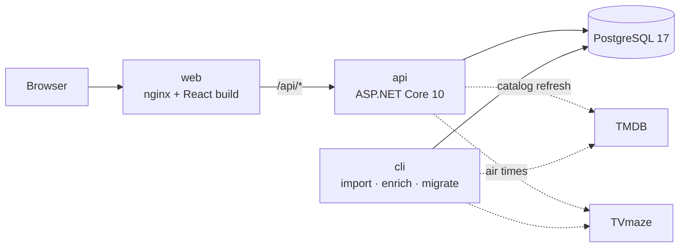

<div align="center">


# Reprise

**A self-hosted TV show tracker built around rewatching.**

I built it when TV Time shut down and took everyone's watch history with it.

[](https://github.com/GabrielfSilveiraDev/reprise/actions/workflows/ci.yml)
[](LICENSE)


[Português](README.pt-BR.md) · [Quick start](#quick-start) · [Architecture](#architecture) · [Docs](#documentation)



</div>

> [!NOTE]
> The interface is in Brazilian Portuguese, and so are the code comments and the in-depth docs.

## Why

Most trackers store "watched" as a checkbox. That breaks the moment you rewatch a show: the
checkbox is already ticked, so the second time through leaves no trace. Reprise is built on one
rule:

> **A watch is an event, not a boolean.**

Every time you watch an episode, a row is appended to `watch_events`. Progress, rewatch counts,
streaks and monthly stats are all *derived* from that log — never mutable state kept in sync.

## Features

- **Import from TV Time** — reads the GDPR export, idempotently (re-running never duplicates) and
  with a reconciliation report that proves every row was accounted for.
- **Up next** — the next episode of every show you watched in the last month, rewatches included, marked
  with one tap and an undo.
- **Episode map** — one square per episode, colored by how many times you've seen it.
- **Release calendar** — upcoming episodes in *your* time zone, combining TMDB dates with TVmaze
  air times, because a date without a time zone is how "aired today" shows up a day early.
- **Stats** — screen time, streaks, a yearly heatmap, and where your time went, each chart with
  the table behind it.
- **Three designs**, each with light and dark themes, picked per browser.
- **Your data, portable** — a complete, rebuildable JSON export of every watch.
- **Multi-user** — each person with their own login and history.

## Screenshots

| Brasa | Sessão | Grade |
|:---:|:---:|:---:|
|  |  |  |

<table>
  <tr>
    <td width="70%"></td>
    <td width="30%"></td>
  </tr>
  <tr>
    <td colspan="2"></td>
  </tr>
</table>

*Screenshots come from the end-to-end test suite, running against a mocked API with made-up shows.*

## Quick start

You only need [Docker](https://www.docker.com/).

```bash
git clone https://github.com/GabrielfSilveiraDev/reprise.git
cd reprise
cp .env.example .env
# Edit .env and set Jwt__Secret — generate one with: openssl rand -base64 48
docker compose up -d --build
```

Reprise is now at **http://localhost:8080**. Sign-up is closed by default, so create your account
from the CLI:

```bash
docker compose run --rm cli passwd --email me@reprise.local --password "choose-a-password" --user yourname
```

`me@reprise.local` is the built-in owner account — the one the TV Time import writes to. Log in
with the username you picked.

**Bringing your TV Time history:** put the export `.zip` in `./gdpr-data`, then:

```bash
docker compose run --rm cli /data/your-export.zip --dry-run   # check, writes nothing
docker compose run --rm cli /data/your-export.zip             # import
docker compose run --rm cli enrich                            # fill the catalog from TMDB
```

The TMDB step (and searching for new shows) needs a free
[TMDB API key](https://www.themoviedb.org/settings/api) in `Tmdb__ApiKey`. Everything else works
without one.

## Architecture



| | Stack |
|---|---|
| **API** (`apps/api`) | .NET 10, ASP.NET Core Minimal APIs, EF Core, PostgreSQL, ASP.NET Identity + JWT |
| **Web** (`apps/web`) | React 19, TypeScript, Vite, TanStack Router and Query, Tailwind CSS 4, Radix UI, Recharts |
| **Tests** | xUnit + Testcontainers (real Postgres), Vitest, Playwright |
| **Delivery** | Docker Compose, GitHub Actions, Dependabot |

### Engineering highlights

- **Append-only event log as the source of truth.** Nothing is stored that can be derived, so a
  rewatch, a backfilled watch or a deleted one never leaves counters out of sync.
- **Idempotent, verifiable import.** Each CSV row's natural key is kept under a partial unique
  index, so re-importing only adds what is missing. Hard invariants (every row read is accounted
  for) fail the run, while mismatches against the vendor's own stats are only reported — they
  don't even agree with its own records.
- **Multi-tenant from day one.** A global EF Core query filter scopes every query to the current
  user. Going from single-user to multi-user meant swapping one `ICurrentUser` implementation —
  no query changed.
- **Typed contract, end to end.** The web client's types are generated from the API's OpenAPI
  document, and CI fails if the committed contract drifts from what the API serves.
- **Tests against the real thing.** Integration tests run on a throwaway PostgreSQL via
  Testcontainers, because what they guard (SQL translation, null ordering, tenant isolation) is
  exactly what an in-memory fake would wave through.
- **Careful auth.** 30-minute access tokens with rotating 60-day refresh tokens stored only as
  hashes, per-IP rate limiting on login and verification codes, and sign-up closed by default.
- **One model, three designs.** Each screen has a single model and one view per design; a
  `Record` over the design names makes a missing view a compile error.

## Documentation

In-depth docs are in Portuguese:

- [Architecture and decisions](docs/arquitetura.md) — the event log, the .NET projects, auth, export
- [Import and catalog](docs/importacao-e-catalogo.md) — TV Time import, TMDB enrichment, TVmaze schedule
- [Web client](docs/web.md) — screens, the three designs, the API contract
- [Development](docs/desenvolvimento.md) — running without Docker, tests, CI
- [Windows](docs/windows.md) — one-click launcher and running tests under Smart App Control

## Contributing

Issues and pull requests are welcome — see [CONTRIBUTING.md](CONTRIBUTING.md). To report a
security issue, please follow [SECURITY.md](SECURITY.md).

## License

[MIT](LICENSE) © Gabriel Silveira
