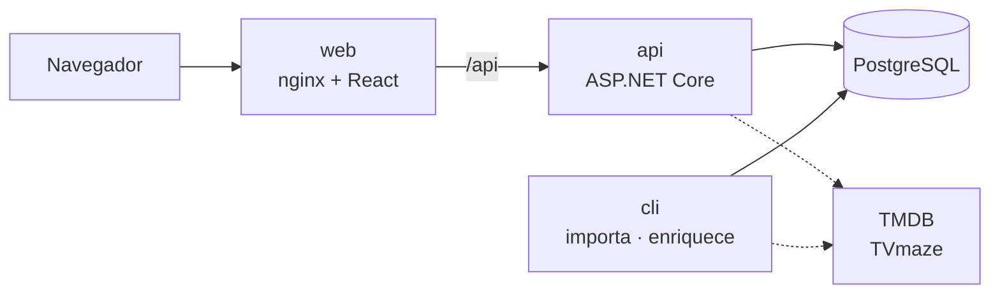

<div align="center">


# Reprise

**Um rastreador de séries auto-hospedado, feito em torno de reassistir.**

Nasceu quando o TV Time fechou e levou junto o histórico de todo mundo.

[](https://github.com/GabrielfSilveiraDev/reprise/actions/workflows/ci.yml)
[](LICENSE)


[English](README.md) · [Início rápido](#início-rápido-com-docker) · [Arquitetura](#arquitetura) · [Documentação](#documentação)


</div>

## Por quê

A maioria dos rastreadores guarda "visto" como uma caixinha marcada. Isso quebra na primeira vez
que você revê uma série: a caixinha já está marcada, e a segunda passada não deixa rastro. O
Reprise parte de uma regra só:

> **Uma exibição é um evento, não um booleano.**

Cada vez que você vê um episódio, uma linha entra em `watch_events`. Progresso, contagem de
revisões, sequências e estatísticas por mês são **derivados** desse log — nunca estado mutável
mantido em sincronia.

## O que ele faz

- **Importa o TV Time** — lê o export do pedido de GDPR, de forma idempotente (rodar de novo não
  duplica nada) e com um relatório de conferência que prova que toda linha foi contabilizada.
- **Agora** — o próximo episódio de cada série vista no último mês, revisões incluídas, marcado
  com um toque e com "Desfazer".
- **Mapa de episódios** — um quadrado por episódio, na cor de quantas vezes você o viu.
- **Agenda de estreias** — o que vai sair, no *seu* fuso, juntando as datas do TMDB com os
  horários do TVmaze: data sem fuso é como um episódio aparece "estreou hoje" um dia antes.
- **Números** — tempo diante da tela, sequências, calendário do ano e para onde foi o seu tempo,
  cada gráfico com a tabela por trás.
- **Três designs**, cada um com tema claro e escuro, escolhidos por navegador.
- **Seus dados, portáveis** — export completo e reconstruível em JSON, com cada exibição.
- **Multiusuário** — cada pessoa com login e histórico próprios.

## Telas

| Brasa | Sessão | Grade |
|:---:|:---:|:---:|
|  |  |  |

<table>
  <tr>
    <td width="70%"></td>
    <td width="30%"></td>
  </tr>
  <tr>
    <td colspan="2"></td>
  </tr>
</table>

*As capturas saem da suíte de testes de ponta a ponta, contra uma API simulada com séries inventadas.*

## Início rápido com Docker

Só é preciso o [Docker](https://www.docker.com/).

```bash
git clone https://github.com/GabrielfSilveiraDev/reprise.git
cd reprise
cp .env.example .env
# Edite o .env e preencha Jwt__Secret — gere um com: openssl rand -base64 48
docker compose up -d --build
```

O Reprise abre em **http://localhost:8080**. O cadastro vem fechado, então a conta sai pela CLI:

```bash
docker compose run --rm cli passwd --email me@reprise.local --password "escolha-uma-senha" --user seunome
```

`me@reprise.local` é a conta-dona, criada pelas migrações — é nela que a importação do TV Time
grava. Entre com o nome de usuário que você escolheu.

**Trazendo o histórico do TV Time:** ponha o `.zip` do export em `./gdpr-data` e rode:

```bash
docker compose run --rm cli /data/seu-export.zip --dry-run   # confere, sem gravar nada
docker compose run --rm cli /data/seu-export.zip             # importa
docker compose run --rm cli enrich                           # completa o catálogo pelo TMDB
```

O passo do TMDB (e a busca de séries novas) precisa de uma
[chave gratuita do TMDB](https://www.themoviedb.org/settings/api) em `Tmdb__ApiKey`. Todo o resto
funciona sem ela.

## Arquitetura



| | Stack |
|---|---|
| **API** (`apps/api`) | .NET 10, ASP.NET Core Minimal APIs, EF Core, PostgreSQL, ASP.NET Identity + JWT |
| **Web** (`apps/web`) | React 19, TypeScript, Vite, TanStack Router e Query, Tailwind CSS 4, Radix UI, Recharts |
| **Testes** | xUnit + Testcontainers (Postgres de verdade), Vitest, Playwright |
| **Entrega** | Docker Compose, GitHub Actions, Dependabot |

### Decisões de engenharia

- **Log de eventos append-only como fonte da verdade.** Nada que possa ser derivado é guardado,
  então uma revisão, uma exibição recolocada ou uma removida nunca deixa contador fora de sincronia.
- **Importação idempotente e conferível.** A chave natural de cada linha do CSV fica sob um índice
  único parcial, então reimportar só acrescenta o que falta. Invariantes duros (toda linha lida foi
  contabilizada) reprovam a execução; divergências contra as estatísticas do próprio TV Time só são
  registradas — nem elas batem com os registros dele.
- **Multi-tenant desde o dia 1.** Um filtro global do EF Core restringe toda consulta ao usuário
  atual. Passar de um usuário para vários foi trocar uma implementação de `ICurrentUser` — nenhuma
  consulta mudou.
- **Contrato tipado de ponta a ponta.** Os tipos do web são gerados do OpenAPI da API, e o CI
  falha se o contrato versionado divergir do que a API publica.
- **Testes contra o que é de verdade.** Os de integração rodam num PostgreSQL descartável via
  Testcontainers, porque o que eles protegem (tradução para SQL, ordem dos nulos, isolamento entre
  usuários) é justamente o que um fake em memória deixaria passar.
- **Autenticação cuidadosa.** Token de acesso de 30 minutos, refresh de 60 dias rotativo e guardado
  só como hash, limite de tentativas por endereço no login e no código de validação, e cadastro
  fechado por padrão.
- **Um modelo, três designs.** Cada tela tem um modelo e uma vista por design; um `Record` sobre os
  nomes dos designs faz uma vista esquecida virar erro de compilação.

## Documentação

- [Arquitetura e decisões](docs/arquitetura.md) — o log de eventos, os projetos .NET, autenticação, export
- [Importação e catálogo](docs/importacao-e-catalogo.md) — TV Time, enriquecimento pelo TMDB, agenda do TVmaze
- [Cliente web](docs/web.md) — telas, os três designs, o contrato da API
- [Desenvolvimento](docs/desenvolvimento.md) — rodar sem Docker, testes, CI
- [Windows](docs/windows.md) — abrir com um clique e testes com o Smart App Control

## Contribuindo

Issues e pull requests são bem-vindos — ver [CONTRIBUTING.md](CONTRIBUTING.md). Para relatar uma
falha de segurança, siga o [SECURITY.md](SECURITY.md).

## Licença

[MIT](LICENSE) © Gabriel Silveira
